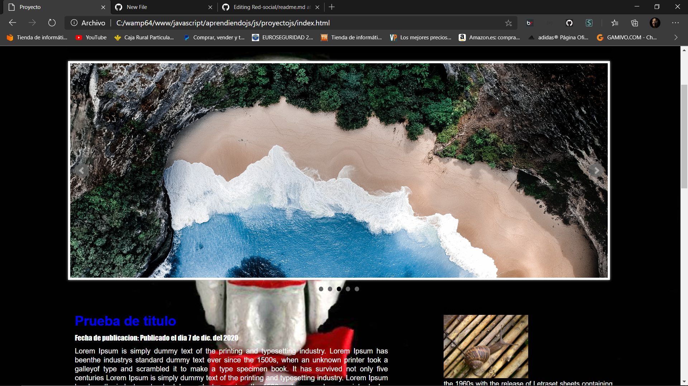

#BLOG
Montaje de un pequeño blog hecho JavaScript sin conexión a base de datos

# CAPTURAS DE PANTALLA

Haciendo click en un botón se cambia de tema a un tema oscuro con una imagen de fondo 

Pagina de un formulario con validación 

Pagina con un reloj digital dinámico

Pagina sobre mi donde se muestran los datos en forma de acordeón gracias a un plugin de JQuery

